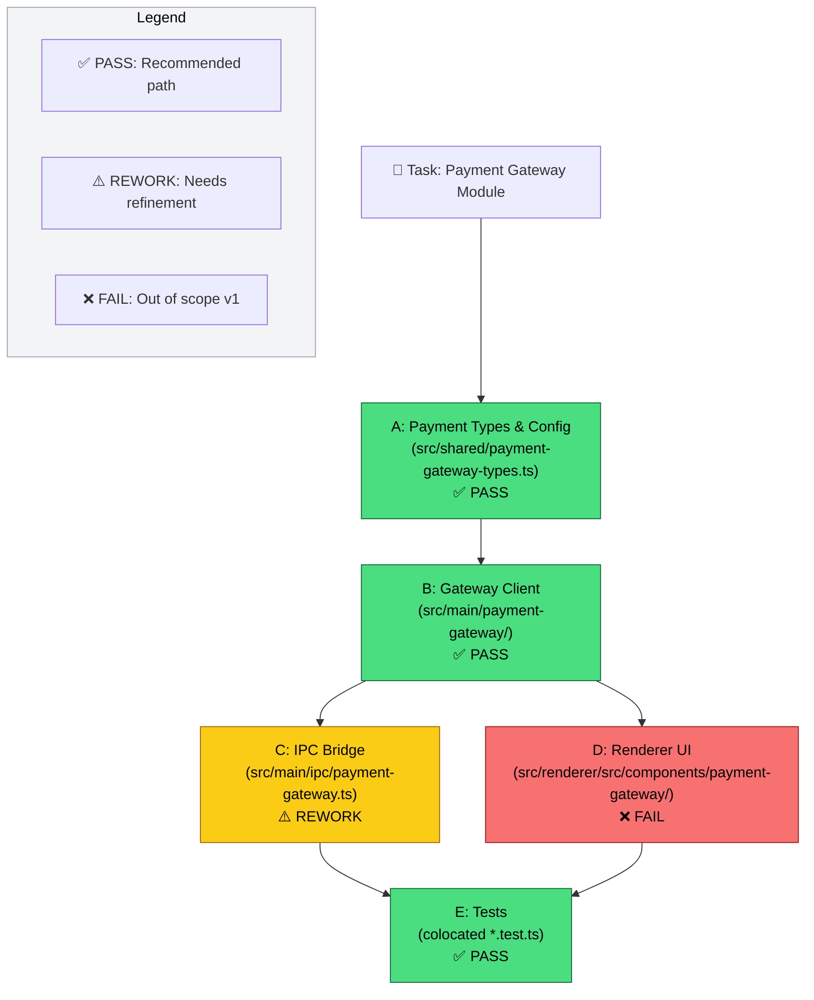

# GoT Plan — Create new module untuk payment gateway

_Generated by: Saarah · Codebase: Orca · Repo: /home/rizoa/BUSINESS/IKAMAI/orca_

---

## Codebase Reasoning

Orca adalah Electron app dengan 4 layer utama: `src/shared/` (pure types + helpers, no runtime deps), `src/main/` (Node.js main process — service modules seperti `gitlab/issues.ts`, `source-control/hosted-review-creation.ts`), `src/main/ipc/` (bridge IPC handlers), dan `src/renderer/` (React + shadcn/ui). Sebuah "payment gateway module" sebaiknya mengikuti pola yang sama: **shared types → main process service → IPC bridge → renderer UI** — dengan test colocated di tiap layer.

---

## Graph of Thoughts

### Nodes

| ID | Nama | Tujuan | File Path | Depends On |
|----|------|--------|-----------|------------|
| **A** | Payment Types & Config | Define shared types: `PaymentGatewayConfig`, `PaymentProvider`, `TransactionStatus`, `PaymentResult` | `src/shared/payment-gateway-types.ts` | — |
| **B** | Payment Gateway Client | Core gateway logic: HTTP client, provider abstraction, transaction lifecycle | `src/main/payment-gateway/client.ts`, `src/main/payment-gateway/gateway.ts` | A |
| **C** | IPC Bridge | Expose gateway operations to renderer via `handle`/`invoke` | `src/main/ipc/payment-gateway.ts` | B |
| **D** | Renderer UI | Payment settings page: config form, provider selector, transaction history | `src/renderer/src/components/payment-gateway/` + page route | C |
| **E** | Tests | Unit + integration test per layer | Colocated `*.test.ts` di tiap folder | A, B, C, D |

### Evaluasi

| Node | Verdict | Alasan |
|------|---------|--------|
| A | ✅ PASS | Pure types, no runtime deps. Mirip `src/shared/gitlab-types.ts` — pattern sudah mapan. |
| B | ✅ PASS | Node.js service, bisa reuse `src/main/gitlab/client.ts` HTTP pattern. |
| C | ⚠️ REWORK | IPC handler perlu dipisah: `list`/`get`/`create`/`update` operation, bukan single endpoint. |
| D | ❌ FAIL | UI payment out of scope untuk v1 — cukup shared types + main process + tests dulu. |
| E | ✅ PASS | Colocated test per layer, ikut pattern existing (`*.test.ts`). |

### Recommended Path (topological order)

```
A → B → C → E
```

Skip D (UI) untuk v1.

---

### Mermaid Diagram



---

## Subtask Breakdown (for implement stage)

| # | Role | Title | Description |
|---|------|-------|-------------|
| 1 | implement | Payment types — `src/shared/payment-gateway-types.ts` | `PaymentGatewayConfig`, `PaymentProvider`, `TransactionStatus`, `PaymentResult` — pure types, reusable. |
| 2 | implement | Gateway client — `src/main/payment-gateway/` | `client.ts` (HTTP wrapper), `gateway.ts` (provider abstraction), `providers/` (implementations). Mirip `src/main/gitlab/client.ts` pattern. |
| 3 | implement | IPC bridge — `src/main/ipc/payment-gateway.ts` | `handle`/`invoke` untuk `listConfigs`, `createTransaction`, `getStatus`. Ikut `src/main/ipc/gitlab.ts`. |
| 4 | test | Unit tests per layer | Colocated: `payment-gateway-types.test.ts`, `gateway.test.ts`, `ipc/payment-gateway.test.ts`. |
| 5 | review | Code review & integration | Review contract antar layer, verify IPC flow, gate readiness. |